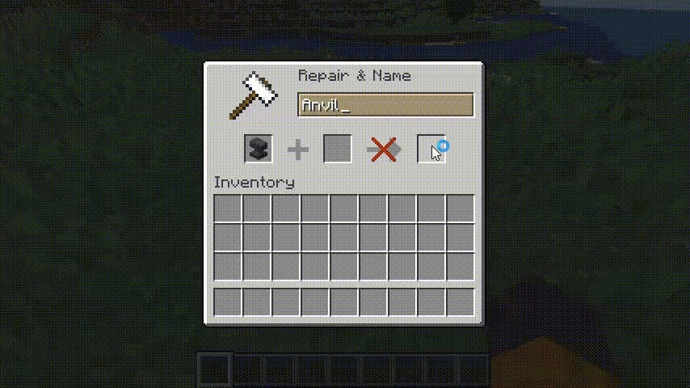

# Formatted Anvils
  
A simple plugin that allows the use of MiniMessage tags inside of Minecraft Anvils.  
Requires PaperMC 1.18.2 or newer. Tested against Paper 1.20.4.
  
### Permissions
- anvilformat.reload - Allows running /anvilformatreload
- anvilformat.filter.bypass - Allows bypassing the filter
- anvilformat.format - Allows formatting
- anvilformat.noitalics - Removes Minecraft's automatic italics of renamed items
- anvilformat.tag.any - Allows any MiniMessage tag
- anvilformat.tag.color
- anvilformat.tag.gradient
- anvilformat.tag.decorations
- anvilformat.tag.newline

### Default config
```yaml
# Java RegExp filter for banned words
filter:
  enabled: false
  patterns:
    - "foo"
    - "bar"
    # a regex pattern for four letter string that starts with 'J' and end with 'a'
    - "^J..a$"
```
